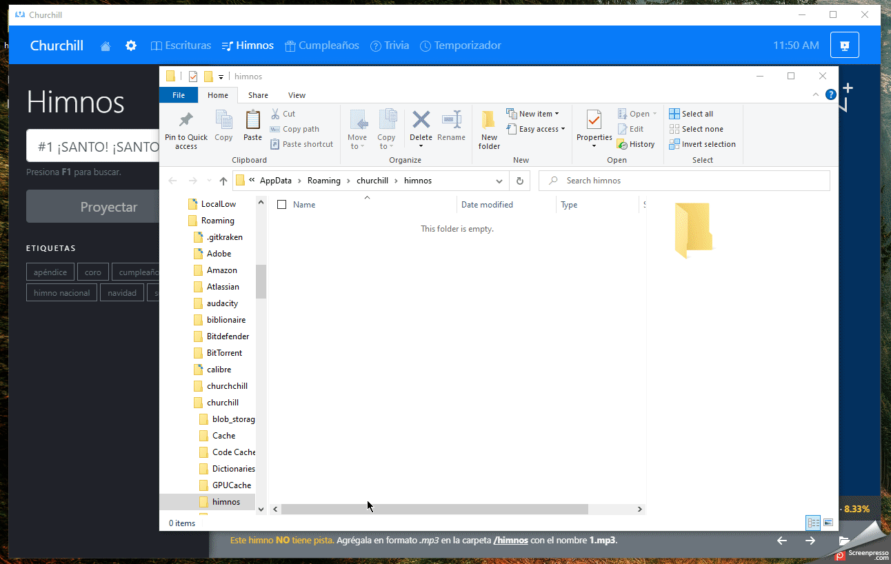
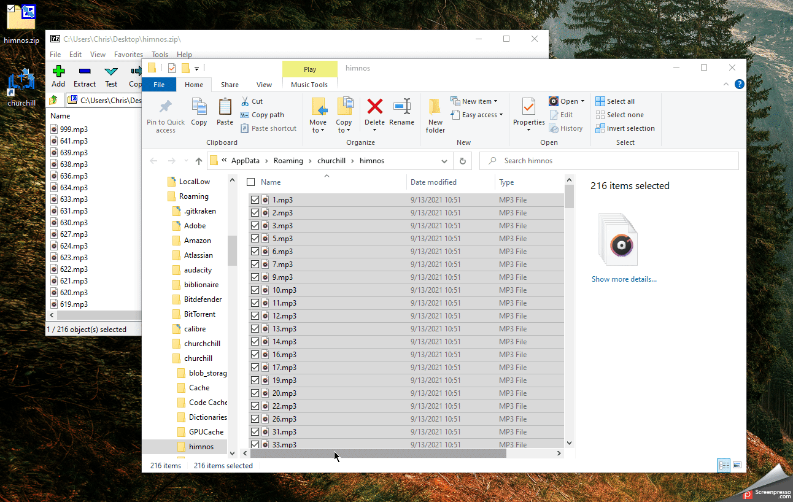

# ¿Cómo agregar las pistas de los himnos a la aplicación?

El primer paso es decargar el archivo comprimido donde estarán los himnos:

- [Descargar Pistas para Himnos (216 pistas)](https://github.com/xtiam57/churchill/releases/download/untagged-a377635c2b97a5b4072a/himnos.zip)

**NOTA: se irá actualizando la lista de descarga de arriba a medida que se agreguen más pistas.**

### Paso 1
Abre la aplicación de **Churchill** y ve a la sección de **Himnos**.

Selecciona cualquier **himno sin pista** y en la parte inferior derecha verás un icono con forma de carpeta. Haz clic allí para abrir la **carpeta de himnos** de la aplicación.

### Paso 2
Abre el archivo comprimido descargado con todos los himnos. Seleccionalos todos y arrastralos a la **carpeta de himnos** de la aplicación.

### Paso 3
Ve a la sección de **Inicio** de la aplicación y regresa a la sección de **Himnos**.

Si todo ha salido bien serás capaz de ver que la barra de herramientas inferior (ubicada debajo del himno) cambia y ahora muestra los **controles de reproducción**.

El proceso es el mismo para agregar nuevos himnos por tu cuenta.

### Restricciones
Las únicas restricciones que existen para agregar pistas nuevas son:
- El nombre del archivo **debe ser el número del himno** (sin espacios adicionales)
- El archivo debe ser formato **MP3**

Si se cumplen estas restricciones la aplicación detectará automaticamente la pista y podra reproducirla.

### ¿Puedo actualizar una pista existente?
Sí. Solo debes abrir la **carpeta de himnos** de la aplicación, reemplazar el archivo **MP3** de la pista y reiniciar la aplicación.
